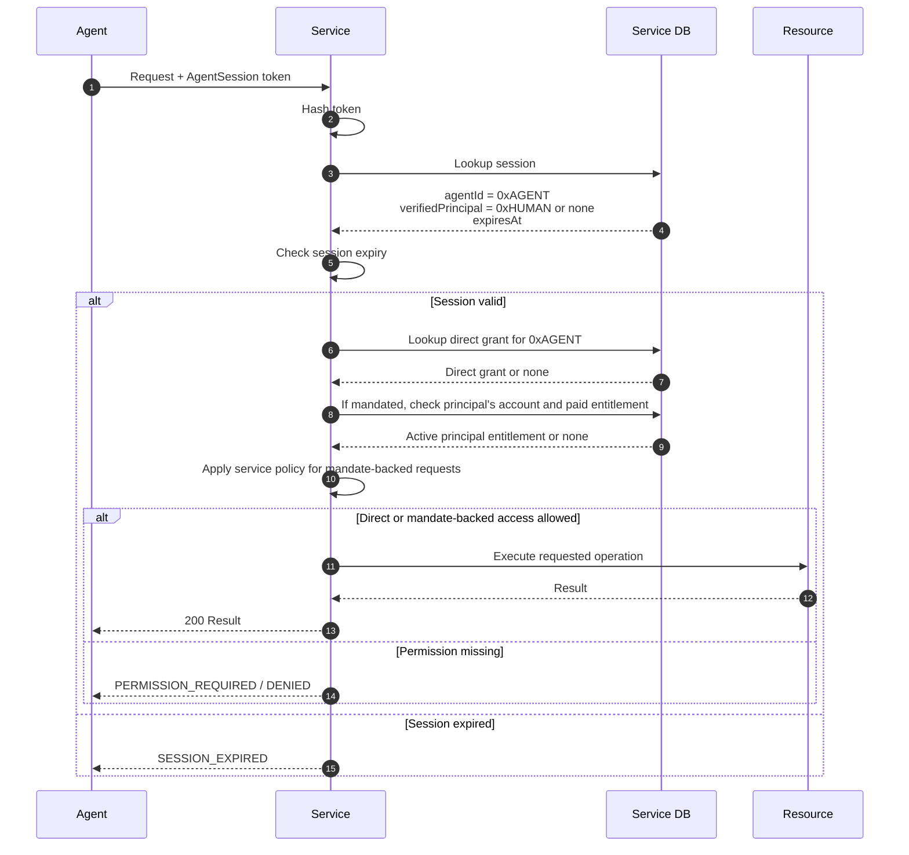

# Agentic World protocol

Agents need to act under a user's authority without becoming the user. Giving an agent the user's OAuth token, API key, or session collapses the distinction between principal and agent. Agentic World gives the agent its own persistent Ethereum identity and lets independent services recognize it as acting under a user-approved mandate.

This document describes the protocol intended for the ETHGlobal Tokyo 2026 prototype. The handoff's unresolved choices remain open where marked below.

## Responsibility boundary

The protocol separates three facts:

1. **Agent identity:** `0xAGENT` proves who is making the request.
2. **User mandate:** `0xHUMAN` explicitly approves that agent to act on their behalf, proven independently of the agent's self-reported `owner()` value. The mandate establishes the relationship; it is not the human's login or a blanket resource grant.
3. **Service authorization:** Each service decides which requests, if any, that mandated agent may make using its own customer accounts, subscriptions, and access policy.

Ethereum and the agent account provide a shared identity and a way to check current authentication authority. A portable mandate can prove the principal–agent relationship to independent services. A service may grant access directly to `0xAGENT` or permit mandate-backed requests for selected resources already available to the principal. Services maintain their own registration, access rules, challenge records, payments, and sessions. They can verify the agent and mandate without an Agentic World authentication server.

The account also governs actions initiated *from the agent account*, such as token payments. That execution policy is separate from a service's resource access policy.

## Identity and keys

```text
0xAGENT root EOA key  ── EIP-7702 delegation ──> AgentAccount at 0xAGENT
                                                  ├── owner: human/org controller
                                                  └── authenticator: operating signer
```

- `0xAGENT` is the stable public identity. Rotating the operating signer does not change it.
- The root EOA key retains ultimate authority to change or clear EIP-7702 delegation. The agent runtime must not hold it.
- The owner controls lifecycle operations inside the delegated account, including rotating or revoking the authenticator.
- The authenticator signs routine authentication proofs. Its private key may be held by AWS KMS. It cannot manage identity lifecycle or loosen execution policy.

EIP-7702 delegation does not initialize account storage. Bootstrap must be one-time and authorized by the root EOA key; an unauthenticated, first-caller-wins initializer is unsafe. In the prototype, the intended owner sends `initialize(...)` directly to `0xAGENT`, so the delegated code stores `owner = msg.sender`; a root-signed permit also binds that owner, the authenticator, agent address, chain, nonce, and deadline. Services do not rely on this stored owner value alone for mandate-backed access. [EIP-7702 security considerations](https://eips.ethereum.org/EIPS/eip-7702#front-running-initialization)

### Agent creation and bootstrap

```mermaid
sequenceDiagram
    autonumber

    participant H as Human / Owner
    participant A as 0xAGENT EOA
    participant C as AgentAccount
    participant K as KMS / Authenticator
    participant E as Ethereum
    participant M as MandateRegistry

    H->>A: Create 0xAGENT
    Note over A: Persistent Agent ID

    H->>K: Create operating signing key
    K-->>H: Public key
    H->>H: Derive 0xAUTHENTICATOR

    H->>A: Authorize EIP-7702 delegation
    A->>E: Delegate to AgentAccount implementation

    Note over A,C: 0xAGENT now executes<br/>AgentAccount code via EIP-7702

    H->>A: Send initialize(...) with agent-root permit
    Note over H,A: owner = 0xHUMAN<br/>authenticator = 0xAUTHENTICATOR

    A->>C: Execute initialize(...)
    C->>C: Verify root permit binds msg.sender
    C->>C: Store owner = msg.sender
    C->>C: Store authenticator
    C->>C: Store createdAt
    C->>C: Mark initialized

    Note over A: 0xAGENT is ready

    H->>A: Request agent-root registration permit
    A-->>H: AgentRegistration signature
    H->>M: register(0xAGENT, permit)
    M->>M: Verify agent-root permit
    M->>M: principalOf(0xAGENT) = msg.sender

    H->>K: Grant agent runtime signing access
```



The diagram separates the agent address from its delegated implementation for readability. Delegated code runs in `0xAGENT`'s account context, so initialized storage belongs to `0xAGENT`. The owner sends both the initialization and registry-registration transactions directly. `msg.sender` proves who sent each transaction, while the separate agent-root permits prove the agent agreed to initialization and registration. The service **cannot infer historical owner consent from the current implementation and `owner()` alone**: the root key could temporarily delegate to other code, write a false owner into persistent storage, and switch back. The registry's record is independent of that storage. [EIP-7702 storage management](https://eips.ethereum.org/EIPS/eip-7702#storage-management)

The bootstrap permit is EIP-712 with domain `name = "Agentic World AgentAccount"`, `version = "1"`, the intended `chainId`, and `verifyingContract = 0xAGENT`. The `0xAGENT` root EOA signs `AgentInitialization(address agent,address owner,address authenticator,uint256 nonce,uint64 deadline)`. `initialize(...)` requires the signed `owner` to equal its actual `msg.sender`, the signed `agent` to equal `address(this)`, the current one-time bootstrap nonce, and an unexpired deadline. The human's transaction and root permit are separate approvals.

## Reference authentication handshake

```text
Service generates and stores a random, single-use challenge
  → Agent builds an AgentAuthentication message for that service
  → Agent computes its EIP-712 digest
  → Operating key signs the digest, optionally through KMS
  → Agent sends the message and signature to the service
  → Service validates the message against its challenge
  → Service computes the digest itself
  → Service encodes the signed fields with the operating-key signature
  → Service calls 0xAGENT.isValidSignature(digest, encodedSignature) via eth_call
  → Account returns 0x1626ba7e only for a valid current authenticator
  → Service atomically consumes the challenge and creates a short session
  → Service applies its own access rules to resource requests
```

### First connection, authentication, and session

```mermaid
sequenceDiagram
    autonumber

    participant A as Agent
    participant K as KMS / Authenticator
    participant S as Service
    participant E as Ethereum / 0xAGENT
    participant M as MandateRegistry

    A->>S: Connect(agentId = 0xAGENT)

    S->>E: Check delegation pointer; read 0xAGENT.owner()
    E-->>S: Expected implementation / owner hint
    S->>M: principalOf(0xAGENT)
    M-->>S: Registered principal or none
    S->>S: Trust principal only when registry and owner() match

    S->>S: Generate random nonce
    S->>S: Store challenge as unused

    S-->>A: Authentication challenge
    Note over A,S: audience<br/>nonce<br/>issuedAt<br/>expiresAt

    A->>A: Construct EIP-712 AgentAuthentication
    Note over A: agentId = 0xAGENT<br/>audience = Service<br/>nonce = challenge<br/>issuedAt<br/>expiresAt

    A->>K: Sign EIP-712 digest
    K-->>A: Signature

    A->>S: AgentAuthentication + signature

    S->>S: Validate audience
    S->>S: Validate nonce
    S->>S: Validate timestamps
    S->>S: Validate agentId / chain
    S->>S: Recompute digest and encode signed fields with signature

    S->>E: eth_call<br/>0xAGENT.isValidSignature(digest, encodedSignature)

    E->>E: ERC-1271 validation
    Note over E: Recover/check current<br/>operating authenticator

    E-->>S: 0x1626ba7e (VALID)

    S->>S: Atomically consume nonce
    S->>S: Generate random session token
    S->>S: Store H(token) → agentId, optional principal, expiry
    S-->>A: Session token (~60 sec)

    Note over A,S: Authentication complete
```

The service constructs the EIP-712 domain with its expected `chainId` and `verifyingContract = agentId`. `encodedSignature` is `abi.encode(AuthProof)` from the contract ABI, containing the signed fields and the operating-key ECDSA signature.

The agent sends this proof to the service:

```text
{
    agentId     // 0xAGENT
    audience    // the intended service
    nonce       // the service's challenge
    issuedAt
    expiresAt
    signature   // operating-key ECDSA signature, sent alongside the signed data
}
```

The EIP-712 digest covers the `AgentAuthentication` fields below. The signature is the result of signing that digest; it is not itself a field inside the signed struct.

```text
EIP712Domain {
    name = "Agentic World AgentAccount"
    version = "1"
    chainId = expected chain
    verifyingContract = agentId
}

AgentAuthentication {
    address agentId
    bytes32 audienceHash  // keccak256(bytes(canonical audience))
    bytes32 nonce
    uint64 issuedAt        // Unix seconds
    uint64 expiresAt       // Unix seconds
}
```

The agent's wire message carries the readable `audience`; the service first checks it against its configured audience and then hashes its canonical bytes into `audienceHash`. The service builds the domain from its expected chain and challenge-bound `agentId`, then recomputes the digest. It does not trust domain fields or a digest supplied by the agent. The SDK requires an exact canonical HTTPS origin as the audience and allows at most 30 seconds of future clock skew for `issuedAt`. [EIP-712](https://eips.ethereum.org/EIPS/eip-712)

### What each verifier checks

The service generates an unpredictable challenge, preferably 256 bits, and stores it with the expected agent, audience, expiry, and consumption state. If the agent is new to the service, the service binds the claimed `agentId` to that challenge when it issues it.

Before `eth_call`, the service checks:

1. `agentId` equals the agent bound to its challenge; this is the `0xAGENT` it will call.
2. The EIP-712 domain's `verifyingContract` equals `agentId`.
3. The EIP-712 domain's `chainId` equals the service's expected chain.
4. `audience` equals this service's configured audience.
5. `nonce` exists in the service's challenge store, is unused, and is still within the challenge's lifetime.
6. `issuedAt` is within the service's allowed time window, and `expiresAt` has not passed.

The service recomputes the digest from those verified fields and the expected domain. A valid ERC-1271 result is followed by atomic challenge consumption and session issuance.

The prototype SDK must read the EIP-7702 delegation pointer at `0xAGENT` and compare it to its configured implementation address for that chain. It then calls methods at **`0xAGENT`**, not at the implementation address. For mandate-backed access it also reads the separately configured `MandateRegistry`. Pinning the current implementation cannot by itself prove that historical storage writes were authorized. A claimed version or ERC-165 response alone is not a security guarantee about arbitrary account code.

The account's ERC-1271 method checks the digest and signature against its current authentication policy. On success it returns the standard magic value `0x1626ba7e`. The method is read-only; it cannot consume the service's challenge. The service therefore consumes the challenge atomically after successful verification, so two concurrent submissions cannot create two sessions from one nonce. [ERC-1271](https://eips.ethereum.org/EIPS/eip-1271)

The return value means the account accepts **this signature for this digest in the current onchain state**. It does not mean the service's nonce is fresh, the audience is correct, or the agent has permission to use a resource. Those checks belong to the service.

### Restrict what the operating key can sign for

This restriction is especially important because v3 also gives the account an execution policy. A generic `isValidSignature(hash, rawOperatingSignature)` implementation would accept any digest signed by the operating key. Another application that accepts ERC-1271 signatures could then treat that key as a broader wallet signer, bypassing the intended account execution boundary.

For the prototype, the service ABI-encodes `AuthProof {agentId, audienceHash, nonce, issuedAt, expiresAt, authenticatorSignature}` as the ERC-1271 `signature` argument. The account recomputes the allowed typed digest using its own address as `verifyingContract` and the current chain ID, requires it to equal the supplied `hash`, checks that the authenticator is active, and only then validates the ECDSA signature. The service still verifies its own audience, challenge, and time rules. Malformed envelopes and arbitrary operating-key signatures return the invalid magic value. Contract-level and SDK interoperability tests cover this flow.

Owner approvals for account actions use a **separate** typed message and replay nonce. The operating authenticator's authentication proof must never double as an owner approval.

### KMS signing

When AWS KMS signs an already computed EIP-712 digest, its request must use `MessageType: DIGEST` to avoid hashing the digest again. KMS returns an ECDSA signature in DER format; the agent signer adapts it to the signature format expected by the account and handles low-s normalization and recovery parity correctly. KMS protects key custody, but a compromised runtime that may call `kms:Sign` can still request signatures until that access is removed. [AWS KMS Sign API](https://docs.aws.amazon.com/kms/latest/APIReference/API_Sign.html)

### Session and revocation semantics

A successful handshake may produce a short-lived, opaque service-local session. A 60-second lifetime is a demo default, not a protocol rule. The service may cache a *mandate-verified* principal address with the agent ID in that session. The token is a cached authentication result, not the agent's identity, mandate, or a grant of resource access; the service checks its own policy and the principal's current service-side entitlement on use.

### Requests after session creation



Rotating or revoking the authenticator blocks *new* authentication once the service observes the changed chain state. An existing session may remain usable until its expiry unless the service checks an authentication epoch or another revocation signal on each request. Immediate invalidation is an open product decision; the prototype must describe whichever behavior it implements. The root EOA can also change delegated code, so services must not treat a prior verification as a permanent guarantee about current account behavior.

## User mandate and service authorization

After authenticating `0xAGENT`, a service can check a direct local grant for that agent. Alternatively, it can verify a user mandate, match its principal `0xHUMAN` to an existing paid or registered account, and permit the agent to request selected resources on that principal's behalf. The service must explicitly mark those resources as eligible for mandated agents. Neither agent authentication nor the mandate alone grants resource access, and the agent never receives the human's credential.

For example, Service A has already verified that `0xHUMAN` controls its registered address and has an active paid `dataset.read` entitlement. On first connection, Service A authenticates `0xAGENT`, reads `owner() = 0xHUMAN`, and confirms `MandateRegistry.principalOf(0xAGENT) = 0xHUMAN`. On a dataset request, it checks that the paid entitlement is still active and that its own policy permits mandated agents to request `dataset.read`. It may then serve the data under the agent's *own* short-lived session. Service A can still require a direct agent grant or fresh human approval for `billing.manage`, destructive writes, or any other excluded operation. Service B can make a different choice using the same agent identity and mandate.

This feature depends on two independent facts: the principal genuinely mandated this agent, and the service intentionally allows the particular request. Neither a self-reported `owner()` nor a pinned current implementation proves the mandate, because another delegate could previously have modified the same storage. The registry record is written by a transaction from the principal, guarded by an agent-root permit, and cannot be rewritten by the agent's EIP-7702 storage operations. The current registry state is shared across services; an existing service session may still cache an older result until expiry unless it rechecks on each request.

### Onchain mandate registration for the prototype

The owner sends `MandateRegistry.register(agent, nonce, deadline, agentRootSignature)` directly. The registry stores `principalOf(agent) = msg.sender`. The agent root EOA signs this EIP-712 permit, which is separate from the operating authenticator's `AgentAuthentication` proof:

```text
EIP712Domain {
    name = "Agentic World Mandate Registry"
    version = "1"
    chainId = expected chain
    verifyingContract = MandateRegistry
}

AgentRegistration {
    address agent       // 0xAGENT
    address principal   // must equal registration tx msg.sender
    uint256 nonce       // current registry nonceOf(agent)
    uint64 deadline     // Unix seconds
}

agentRootSignature = signature by the 0xAGENT root EOA
```

The principal's transaction is the approval: no separate EIP-712 owner signature is needed for direct registration. The agent-root permit binds the agent, principal, registry, chain, nonce, and deadline so someone else cannot register the agent first. The registry rejects duplicate registrations; only the current principal can call `revoke(agent)`. After revocation, its nonce advances, so an old registration permit cannot be replayed. A relayer would change `msg.sender`, so relayed registration requires a future principal-signed variant.

The registry means: “This principal approved this agent as acting on their behalf.” It does **not** authorize account spending, transfer the principal's session, or compel any service to grant access. At authentication, the SDK checks the expected registry address, reads the active `principalOf(agent)`, and compares it to `0xAGENT.owner()`. Only then may it expose a *mandate-verified principal* to service code. Revocation updates the shared onchain fact immediately; an already-issued session remains bounded by the service's chosen lifetime unless the service rechecks registry state on each request.

## Per-request authentication

A service may require a fresh signature for each request or for selected sensitive actions. That message must additionally bind the HTTP method, canonical path, body hash, and a fresh replay value. The session establishment message above does not need request fields. Per-request signing is optional for the hackathon prototype.

## Account execution policy

The delegated account now enforces an owner-defined, default-deny [execution policy](POLICY.md) for actions submitted by the operating authenticator. A matching rule returns `ALLOW`, `REQUIRE_OWNER_SIGNATURE`, or `DENY`. Required approvals bind the exact agent, chain, target, native value, calldata hash, current policy hash and revision, approval nonce, and deadline. Only the owner can change the policy; service authentication signatures cannot approve execution.

This is a separate authorization boundary from service ACLs and the mandate registry. The policy currently bounds native value, not ERC-20 transfer amounts; a true $2/$20 stablecoin demo needs a narrow token-amount extension. The root EOA retains ultimate EIP-7702 authority and is outside the delegated execution policy's control.

## Demo acceptance cases

- The same `0xAGENT` authenticates independently to two services using one operating key, without sharing their challenge or session databases.
- A proof issued for Service A fails at Service B; an expired or already consumed challenge fails at Service A.
- The service denies a resource when its local permission is absent, even after successful authentication.
- A registered and paid principal can mandate an agent to request a service-approved resource without giving the agent human credentials; a request excluded by service policy is still denied.
- An agent that merely claims someone else's paid address through an untrusted `owner()` implementation cannot establish that person's mandate.
- After the owner rotates the authenticator, the old key cannot create a new session and the new key can, while `0xAGENT` remains unchanged.
- The operating key cannot approve an owner-only action or expand its own execution limits.

## Decisions still open

The contracts choose a pinned EIP-7702 implementation, root-authorized bootstrap, an owner-transaction mandate registry, and a constrained v1 execution policy. The two SDKs choose canonical HTTPS origins and share a tested signature envelope. Remaining decisions include optional authenticator expiry and epoch, immediate session invalidation, deployment networks and addresses, ERC-20 amount rules, and the independent-service demo. These are prototype choices until that demo validates them end to end.
