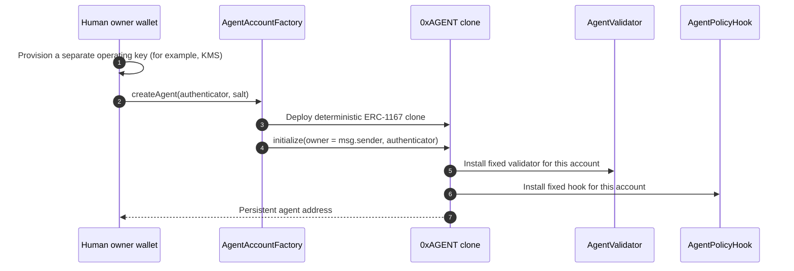
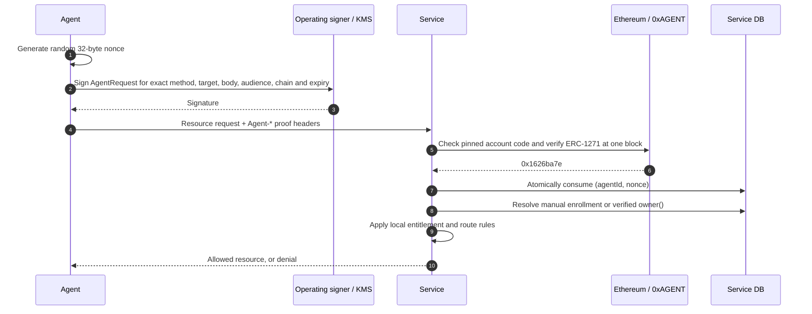

# Agentic World protocol (v0)

Agentic World authenticates an agent as itself instead of giving it a human's OAuth token, API key, or session. The shared onchain fact is the agent account and its current authentication authority. Each service independently decides what that authenticated agent may access. Agentic World does not manage a behavioral mandate, infer the model's intent, or operate a central authentication backend.

This document describes the implemented ERC-4337 / ERC-7579 prototype. It is not a claim of public deployment or full EntryPoint/bundler interoperability; see [implementation status](V0-IMPLEMENTATION.md).

## Four separate decisions

1. **Identity:** `0xAGENT` is a deployed smart account. Its current validator decides whether an operating-key proof is valid.
2. **Association:** a service may link the agent to one of its users through its own explicit enrollment (`manual`) or through the verified account's `owner()` (`owner`).
3. **Service authorization:** that service checks its own route policy, subscription, payment, and agent eligibility. Association does not copy a human's permissions.
4. **Onchain execution policy:** the owner defines which account calls the agent can execute, which require an exact owner approval, and which are denied. This policy does not grant service API access.

## Account creation and authority



The factory transaction sender becomes the owner. Initialization happens atomically after clone deployment and is callable only by that factory. There is no agent-root EOA, EIP-7702 delegation, root-signed bootstrap permit, or `MandateRegistry` registration in v0. The implementation pointer in each clone is immutable, and the account has no owner setter. The owner directly controls operating-key rotation, revocation/restoration, and policy updates; the operating key cannot call those owner-only methods through an ERC-4337 operation.

The factory fixes one `AgentValidator`, one `AgentPolicyHook`, and a configured EntryPoint for its implementation. The account does not permit module installation/removal, executor execution, delegatecall, batch calls, or non-reverting execution modes. This narrow surface is intentional: an operating-key UserOperation must not be able to remove the policy hook or route around it. The account supports only ERC-7579 single-call, revert-on-error execution. [ERC-4337](https://eips.ethereum.org/EIPS/eip-4337), [ERC-7579](https://eips.ethereum.org/EIPS/eip-7579)

## Agent proof format

The operating signer signs an EIP-712 digest under:

```text
EIP712Domain {
    name = "Agentic World AgentAccount"
    version = "1"
    chainId = expected chain
    verifyingContract = 0xAGENT
}
```

Both service-proof types bind `agentId`, `audienceHash = keccak256(canonical HTTPS service origin)`, a 32-byte nonce, `issuedAt`, and `expiresAt`. `AgentRequest` also binds `methodHash`, `targetHash`, and `bodyHash` for the exact HTTP request. The target is the origin-form path plus raw query; the body hash covers the raw bytes. The signer returns a 65-byte Ethereum ECDSA signature over the digest, not an EIP-191 `personal_sign` result. [EIP-712](https://eips.ethereum.org/EIPS/eip-712)

The service reconstructs the digest from its expected chain and audience and the actual request. It calls `0xAGENT.isValidSignature(digest, encodedProof)` using `eth_call`. The account forwards validation to its fixed ERC-7579 `AgentValidator`. The validator checks the current, non-revoked operating key and only accepts the structured `AgentAuthentication` or `AgentRequest` envelope; an arbitrary raw operating-key signature does not become a general ERC-1271 wallet signature. The valid return value is `0x1626ba7e`. [ERC-1271](https://eips.ethereum.org/EIPS/eip-1271)

An ERC-1271 result only says this account currently accepts that proof. It does **not** prove nonce freshness, service permission, payment, or model intent. Those checks remain with the service.

### Preferred: proof on the first resource request



The wire headers are `Agent-ID`, `Agent-Chain-ID`, `Agent-Nonce`, `Agent-Issued-At`, `Agent-Expires-At`, and `Agent-Signature`. The service derives method, target, body hash, and audience from the actual HTTP request and trusted configuration. It rejects duplicate proof headers, wrong chain/audience/request, malformed proof, expiration, and replay. Its nonce store must perform an **atomic insert-if-absent** across workers and retain the key at least through the proof's expiry. An agent-generated nonce is not a service-issued challenge: the service verifies uniqueness and freshness window, not prior issuance. The request proof's ERC-1271 signature argument is `0x41575231` (`AWR1`) followed by `abi.encode(RequestProof)`.

The service needs a documented rule for proxies that rewrite paths or queries before verification. If authorization depends on unsigned headers or content negotiation, the service must normalize or bind those inputs too. The SDK requires a canonical HTTPS audience; a deployment must also enforce HTTPS transport. The current SDK implements this HTTP format; an MCP canonical wire format is **not implemented**.

### Alternative: service-issued challenge

The lower-level SDK also supports `issueChallenge(agentId)` → `answerChallenge(challenge)` → `authenticate(proof)`. Here the service generates and stores the random nonce, expected agent, audience, issue time, and expiry before the agent signs `AgentAuthentication`. The service compares the response with that stored challenge, verifies ERC-1271, then atomically consumes the challenge. It may then issue a short local session. No `/connect` endpoint is required for the preferred first-request flow; a service must expose a way to issue challenges only if it chooses this alternative.

In either flow, the service enforces the time window and replay rule. The validator cannot consume a service's offchain nonce. A valid proof can produce a random, short-lived, service-local session token; the SDK stores only its hash. The integrating service must decide whether to return that token and whether to serve the resource **after** its own authorization check. A token is a cached agent authentication result, not a human credential or resource grant. `readSession` checks expiry and reruns local association, but does not revalidate onchain signer state; immediate invalidation after key revocation requires a service-side recheck or explicit session invalidation.

## Account provenance and owner association

Services configure the expected account implementation address from a trusted deployment, never from agent input. For v0, the service SDK checks the exact ERC-1167 clone runtime pointing to that implementation. It then checks ERC-1271 and, in `owner` mode, reads `owner()` at the same block. A claimed interface, version string, or agent-supplied owner is insufficient. The SDK retains an EIP-7702 pointer check solely for the older prototype; a v0 service should pin the new implementation. No separate onchain registry is required for either association mode.

In `manual` mode, the service resolves an agent through its own enrollment record. In `owner` mode, it resolves the clone's factory-initialized, immutable owner wallet to one of its locally verified users. It may also authorize a direct grant to an agent ID without associating a human at all. Every path still needs a service-local permission decision. For example, a paid `dataset.read` entitlement can be available to an owner's agent while billing changes and destructive writes remain human-only. Service B can make a different choice for the same agent.

## ERC-4337 execution and owner policy

An agent runtime asks its operating key to sign the canonical `userOpHash` for `0xAGENT`; it does not receive the human's key. The configured EntryPoint alone may call the account's `validateUserOp`. The fixed `AgentValidator` checks the operating signature. For execution, the account's ERC-7579 hook checks the proposed single call against the owner-set `PolicyEngine` before it runs, and checks the supported token spend afterward.

Policy defaults to `DENY`. Ordered rules match target, selector, native value, and—for the narrow demo action—`purchaseCompute(address,uint256)` token and amount. A matching rule yields `ALLOW`, `REQUIRE_OWNER_SIGNATURE`, or `DENY`. For the middle case, `executeWithApproval` carries a separate owner EIP-712 signature bound to exact calldata, target, value, policy hash/revision, nonce, deadline, agent, and chain. A service authentication proof cannot satisfy that owner approval. See [policy format](POLICY.md). This is a **per-call** restriction, not a cumulative budget or a general ERC-20 spending firewall.

Local tests cover the mock caller boundary and an operation through the official EntryPoint v0.8 contract, including a deposit, signature rejection, nonce advancement, replay rejection, and policy-allowed execution. The test submits directly to `handleOps`; it does **not** prove bundler interoperability, public-network execution, gas estimation, or production deployment. Those remain [implementation gates](IMPLEMENTATION.md).

## Acceptance and remaining choices

- The same `0xAGENT` can be authenticated independently by two services, each with its own nonce/session store and resource rules. A proof for one audience or request fails at another.
- An expired or reused nonce fails, and a valid signature without a local entitlement still gets no resource.
- The owner can rotate or revoke the operating key without changing the agent address; existing service sessions may remain usable until their short expiry unless rechecked.
- A UserOperation cannot change the owner, remove the hook, install an executor, self-call around policy, or use an unsupported execution mode.
- Public factory/EntryPoint addresses, a real bundler and KMS adapter, durable service stores, two running services, a demo agent, and MCP canonicalization remain open.

The immutable clone makes account provenance simple to verify but prevents an in-place EIP-8141/ERC-8286 code migration at the same agent address. A later standard can be used for new accounts, or preserving existing addresses needs a different upgrade design before deployment.
