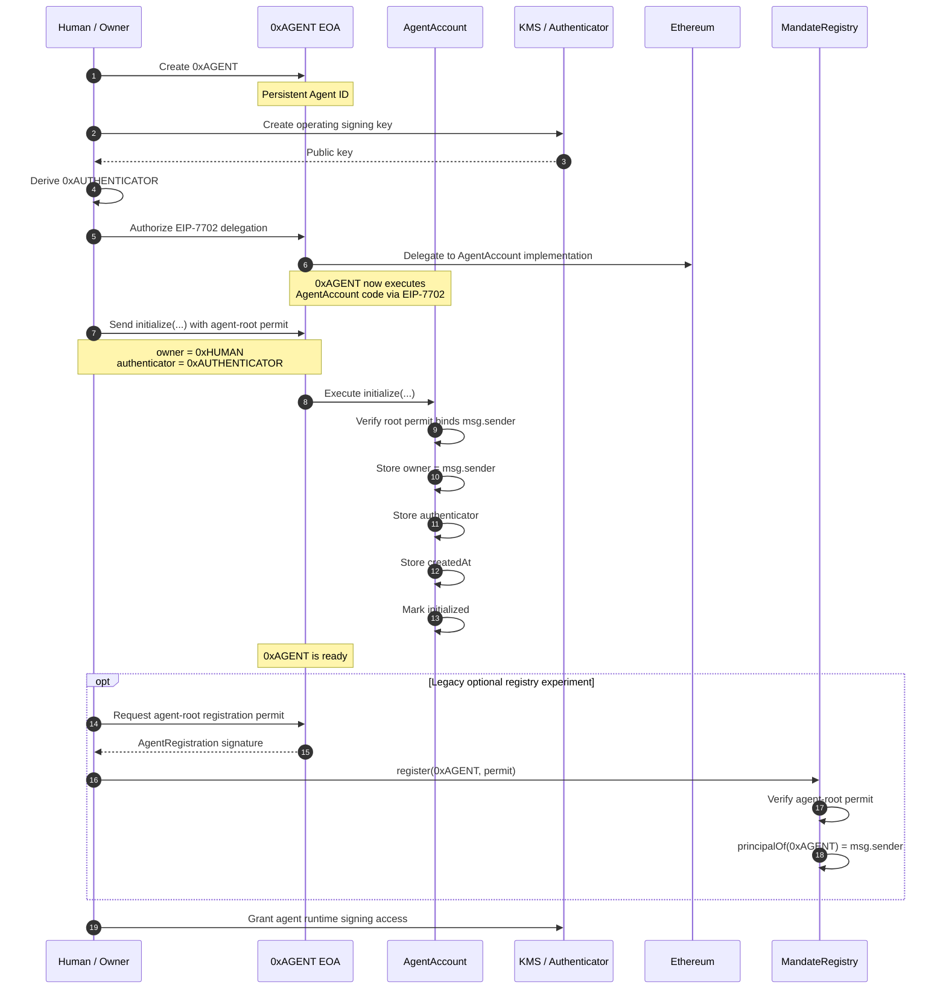
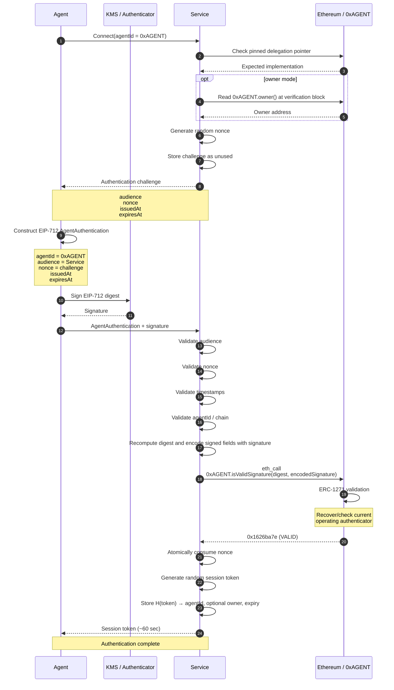
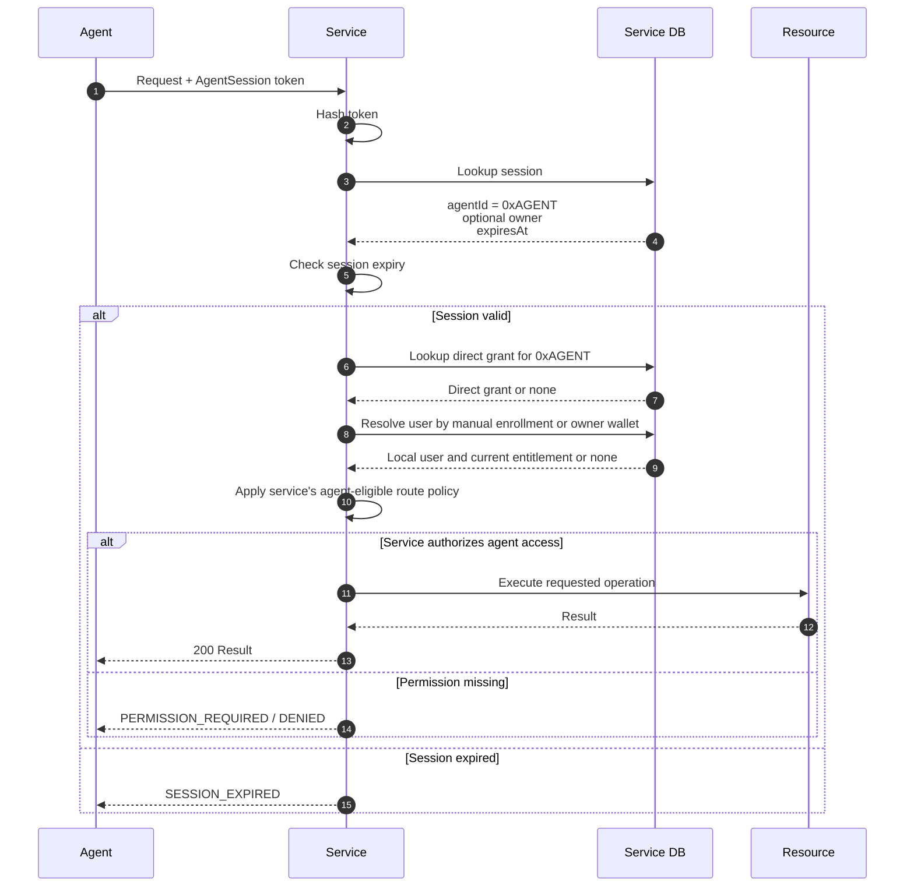

# Agentic World protocol

> **Pre-freeze protocol design:** The EIP-7702 account, root-key bootstrap,
> delegation-pointer verification, and optional `MandateRegistry` described below
> belong to the earlier prototype. The [v0 architecture freeze](ARCHITECTURE-v0.md)
> replaces the account/execution design with ERC-4337 + ERC-7579, while keeping
> independent service authentication and service-local authorization. For the
> implemented account and exact current limitations, start with
> [v0 implementation](V0-IMPLEMENTATION.md).

Agents need to authenticate without becoming the human who operates them. Giving an agent the human's OAuth token, API key, or session collapses that distinction. Agentic World gives the agent its own persistent Ethereum identity that independent services can verify. It does not know or enforce the agent's instructions, intent, or offchain behavior.

This document describes the protocol intended for the ETHGlobal Tokyo 2026 prototype. The handoff's unresolved choices remain open where marked below.

## Responsibility boundary

The protocol separates four facts:

1. **Agent identity:** `0xAGENT` proves who is making the request.
2. **Service association:** A service can link `0xAGENT` to one of its users by explicit local enrollment (`manual`) or by resolving `0xAGENT.owner()` (`owner`). Neither choice proves a behavioral mandate or grants a resource permission.
3. **Owner execution policy:** The owner decides which onchain calls the operating authenticator may execute autonomously, which need an exact owner signature, and which are denied.
4. **Service authorization:** Each service decides which requests, if any, the authenticated agent may make using its own mandates, customer accounts, subscriptions, and access policy.

Ethereum and the agent account provide a shared identity and a way to check current authentication authority. A service may grant access directly to `0xAGENT` or use its chosen association mode as one input to its **own** mandate and entitlement rules. Services maintain their own registration, access rules, replay records, payments, and sessions. They can verify the agent without an Agentic World authentication server.

**An association is not a mandate or permission list.** `manual` mode trusts the service's own enrollment record; `owner` mode reads `owner()` only after pinning the current EIP-7702 implementation and verifying the agent signature. `owner` mode explicitly trusts that the agent root key stays outside the runtime and does not authorize untrusted delegates. Both modes still require the service to check its own account, subscription/entitlement, and whether the requested route permits agents. The historically named `MandateRegistry` is a separate, optional experiment and is not required by either mode.

The account's execution policy governs actions initiated *from the agent account*, such as bounded token purchases. It is separate from a service's resource access policy and does not constrain the EIP-7702 root key.

## Identity and keys

```text
0xAGENT root EOA key  ── EIP-7702 delegation ──> AgentAccount at 0xAGENT
                                                  ├── owner: human/org controller
                                                  └── authenticator: operating signer
```

- `0xAGENT` is the stable public identity. Rotating the operating signer does not change it.
- The root EOA key retains ultimate authority to change or clear EIP-7702 delegation. The agent runtime must not hold it.
- The owner controls lifecycle operations inside the delegated account, including rotating or revoking the authenticator.
- The authenticator signs routine authentication proofs. Its private key may be held by AWS KMS. It cannot manage identity lifecycle or loosen execution policy.

EIP-7702 delegation does not initialize account storage. Bootstrap must be one-time and authorized by the root EOA key; an unauthenticated, first-caller-wins initializer is unsafe. In the prototype, the intended owner sends `initialize(...)` directly to `0xAGENT`, so the delegated code stores `owner = msg.sender`; a root-signed permit also binds that owner, the authenticator, agent address, chain, nonce, and deadline. The operating signer cannot change `owner()`. In `owner` mode, services additionally assume the root-key custodian does not later authorize untrusted code. [EIP-7702 security considerations](https://eips.ethereum.org/EIPS/eip-7702#front-running-initialization)

### Agent creation and bootstrap



The diagram separates the agent address from its delegated implementation for readability. Delegated code runs in `0xAGENT`'s account context, so initialized storage belongs to `0xAGENT`. The owner sends initialization directly: `msg.sender` supplies the owner, and a separate agent-root permit binds that owner to the setup. The optional registry step is legacy and not needed by either current SDK association mode. A service can use `owner()` under the stated root-key trust assumption, but a current implementation pointer cannot prove all historical delegations: the root key could temporarily authorize other code to change persistent storage. [EIP-7702 storage management](https://eips.ethereum.org/EIPS/eip-7702#storage-management)

The bootstrap permit is EIP-712 with domain `name = "Agentic World AgentAccount"`, `version = "1"`, the intended `chainId`, and `verifyingContract = 0xAGENT`. The `0xAGENT` root EOA signs `AgentInitialization(address agent,address owner,address authenticator,uint256 nonce,uint64 deadline)`. `initialize(...)` requires the signed `owner` to equal its actual `msg.sender`, the signed `agent` to equal `address(this)`, the current one-time bootstrap nonce, and an unexpired deadline. The human's transaction and root permit are separate approvals.

## One-request resource authentication (preferred flow)

The agent already knows the service's HTTPS origin and resource URL from its task, configuration, or API documentation. The chain does not discover or route HTTP services. The first request can be the resource request itself; no `/connect` endpoint or service-issued challenge is required:

```mermaid
sequenceDiagram
    autonumber
    participant A as Agent
    participant S as Service
    participant E as Ethereum / 0xAGENT
    participant DB as Service DB
    A->>A: Sign AgentRequest for exact GET /private/report
    A->>S: GET /private/report + Agent-* proof headers
    S->>E: Check pinned EIP-7702 pointer
    opt owner mode
        S->>E: Read owner() at verification block
    end
    S->>E: isValidSignature(request digest, request envelope)
    E-->>S: 0x1626ba7e
    S->>S: Atomically consume agent-generated nonce
    alt manual mode
        S->>DB: Find user explicitly enrolled with agentId
    else owner mode
        S->>DB: Find user by verified owner() address
    end
    S->>S: Check service-managed mandate, entitlement and agent-eligible route rules
    alt Allowed
        S-->>A: 200 report + optional short Agent-Session
    else Denied
        S-->>A: 403; no resource or session returned
    end
```

The operating signer signs `AgentRequest(address agentId,bytes32 audienceHash,bytes32 nonce,uint64 issuedAt,uint64 expiresAt,bytes32 methodHash,bytes32 targetHash,bytes32 bodyHash)` in the same agent-account EIP-712 domain. `audienceHash` is the Keccak-256 hash of the service's canonical HTTPS origin. `methodHash` hashes the uppercase ASCII method; `targetHash` hashes the exact origin-form path and raw query (for example `/private/report?year=2026`); `bodyHash` hashes the raw HTTP body bytes, including the empty body. The digest is also bound to `chainId` and `verifyingContract = agentId`. The agent generates a cryptographically random 32-byte nonce; the service enforces a short lifetime and stores each accepted `(agentId, nonce)` with atomic insert-if-absent until at least expiry. ERC-1271 cannot consume an HTTP nonce by itself.

Wire headers are `Agent-ID`, `Agent-Chain-ID`, `Agent-Nonce`, `Agent-Issued-At`, `Agent-Expires-At`, and `Agent-Signature`. The service derives method, target, body hash, and audience from the **actual** request and its trusted configuration—not from client claims—and rejects duplicate proof headers. The request target must be captured before routing or URL rewriting; if a proxy rewrites it, the proxy and application need one documented canonicalization rule. HTTPS is required. A proof for another method, path, query, body, service, chain, or agent fails. For content-negotiated or header-sensitive actions, the service must fix those interpretation rules or extend the signed fields before treating such headers as authority-bearing.

The ERC-1271 signature argument is `0x41575231` (`AWR1`) followed by `abi.encode(RequestProof)`, separating it from the older challenge-authentication envelope. The contract accepts only the structured `AgentRequest` digest and the current operating signer; it does not grant resource access. The service SDK returns an authenticated agent and an optional service user resolved through `manual` or `owner` mode. The service must apply its own permission decision **before returning** the resource or session token to the agent.

### Challenge-based handshake (also supported)

```text
Service generates and stores a random, single-use challenge
  → Agent builds an AgentAuthentication message for that service
  → Agent computes its EIP-712 digest
  → Operating key signs the digest, optionally through KMS
  → Agent sends the message and signature to the service
  → Service validates the message against its challenge
  → Service computes the digest itself
  → Service encodes the signed fields with the operating-key signature
  → Service calls 0xAGENT.isValidSignature(digest, encodedSignature) via eth_call
  → Account returns 0x1626ba7e only for a valid current authenticator
  → Service atomically consumes the challenge and creates a short session
  → Service applies its own access rules to resource requests
```

### First connection, authentication, and session



The service constructs the EIP-712 domain with its expected `chainId` and `verifyingContract = agentId`. `encodedSignature` is `abi.encode(AuthProof)` from the contract ABI, containing the signed fields and the operating-key ECDSA signature.

The agent sends this proof to the service:

```text
{
    agentId     // 0xAGENT
    audience    // the intended service
    nonce       // the service's challenge
    issuedAt
    expiresAt
    signature   // operating-key ECDSA signature, sent alongside the signed data
}
```

The EIP-712 digest covers the `AgentAuthentication` fields below. The signature is the result of signing that digest; it is not itself a field inside the signed struct.

```text
EIP712Domain {
    name = "Agentic World AgentAccount"
    version = "1"
    chainId = expected chain
    verifyingContract = agentId
}

AgentAuthentication {
    address agentId
    bytes32 audienceHash  // keccak256(bytes(canonical audience))
    bytes32 nonce
    uint64 issuedAt        // Unix seconds
    uint64 expiresAt       // Unix seconds
}
```

The agent's wire message carries the readable `audience`; the service first checks it against its configured audience and then hashes its canonical bytes into `audienceHash`. The service builds the domain from its expected chain and challenge-bound `agentId`, then recomputes the digest. It does not trust domain fields or a digest supplied by the agent. The SDK requires an exact canonical HTTPS origin as the audience and allows at most 30 seconds of future clock skew for `issuedAt`. [EIP-712](https://eips.ethereum.org/EIPS/eip-712)

### What each verifier checks

The service generates an unpredictable challenge, preferably 256 bits, and stores it with the expected agent, audience, expiry, and consumption state. If the agent is new to the service, the service binds the claimed `agentId` to that challenge when it issues it.

Before `eth_call`, the service checks:

1. `agentId` equals the agent bound to its challenge; this is the `0xAGENT` it will call.
2. The EIP-712 domain's `verifyingContract` equals `agentId`.
3. The EIP-712 domain's `chainId` equals the service's expected chain.
4. `audience` equals this service's configured audience.
5. `nonce` exists in the service's challenge store, is unused, and is still within the challenge's lifetime.
6. `issuedAt` is within the service's allowed time window, and `expiresAt` has not passed.

The service recomputes the digest from those verified fields and the expected domain. A valid ERC-1271 result is followed by atomic challenge consumption and session issuance.

The prototype SDK reads the EIP-7702 delegation pointer at `0xAGENT` and compares it to the implementation address supplied in trusted service startup configuration, captured for that SDK instance. It then calls methods at **`0xAGENT`**, not at the implementation address. `owner` mode reads `owner()` there at the same block as ERC-1271 verification; `manual` mode uses service-local enrollment and need not read `owner()`. Neither mode requires a registry. Pinning the current implementation cannot by itself prove that historical storage writes were authorized. A claimed version or ERC-165 response alone is not a security guarantee about arbitrary account code.

The account's ERC-1271 method checks the digest and signature against its current authentication policy. On success it returns the standard magic value `0x1626ba7e`. The method is read-only; it cannot consume the service's challenge. The service therefore consumes the challenge atomically after successful verification, so two concurrent submissions cannot create two sessions from one nonce. [ERC-1271](https://eips.ethereum.org/EIPS/eip-1271)

The return value means the account accepts **this signature for this digest in the current onchain state**. It does not mean the service's nonce is fresh, the audience is correct, or the agent has permission to use a resource. Those checks belong to the service.

### Restrict what the operating key can sign for

This restriction is especially important because v3 also gives the account an execution policy. A generic `isValidSignature(hash, rawOperatingSignature)` implementation would accept any digest signed by the operating key. Another application that accepts ERC-1271 signatures could then treat that key as a broader wallet signer, bypassing the intended account execution boundary.

For the prototype, the service ABI-encodes `AuthProof {agentId, audienceHash, nonce, issuedAt, expiresAt, authenticatorSignature}` as the ERC-1271 `signature` argument. The account recomputes the allowed typed digest using its own address as `verifyingContract` and the current chain ID, requires it to equal the supplied `hash`, checks that the authenticator is active, and only then validates the ECDSA signature. The service still verifies its own audience, challenge, and time rules. Malformed envelopes and arbitrary operating-key signatures return the invalid magic value. Contract-level and SDK interoperability tests cover this flow.

Owner approvals for account actions use a **separate** typed message and replay nonce. The operating authenticator's authentication proof must never double as an owner approval.

### KMS signing

When AWS KMS signs an already computed EIP-712 digest, its request must use `MessageType: DIGEST` to avoid hashing the digest again. KMS returns an ECDSA signature in DER format; the agent signer adapts it to the signature format expected by the account and handles low-s normalization and recovery parity correctly. KMS protects key custody, but a compromised runtime that may call `kms:Sign` can still request signatures until that access is removed. [AWS KMS Sign API](https://docs.aws.amazon.com/kms/latest/APIReference/API_Sign.html)

### Session and revocation semantics

A successful request proof or challenge handshake may produce a short-lived, opaque service-local session. A 60-second lifetime is a demo default, not a protocol rule. In `owner` mode, the service caches the owner address read at authentication; in `manual` mode it stores only the agent ID. The SDK re-runs the service's association callback when reading a session. The token is a cached authentication result, not the agent's identity, a behavioral mandate, or a grant of resource access; the service checks its own policy and current entitlements on use.

### Requests after session creation



Rotating or revoking the authenticator blocks *new* authentication once the service observes the changed chain state. An existing session may remain usable until its expiry unless the service checks an authentication epoch or another revocation signal on each request. Immediate invalidation is an open product decision; the prototype must describe whichever behavior it implements. The root EOA can also change delegated code, so services must not treat a prior verification as a permanent guarantee about current account behavior.

## Service association and authorization

After authenticating `0xAGENT`, the service SDK supports two association modes. In `manual`, the service looks up an explicit enrollment of `agentId` by one of its authenticated users. In `owner`, it reads `0xAGENT.owner()` through the pinned implementation at the authentication block and asks the service's `resolveUser(owner)` callback for a matching verified account. The owner-mode result assumes the agent root key is controlled separately from the runtime and does not authorize untrusted delegates. Neither mode itself grants resource access or a behavioral mandate. The service may also grant access directly to an agent ID without a human association.

For example, Service A has already verified that `0xHUMAN` controls its registered wallet and has an active paid `dataset.read` entitlement. On the signed dataset request, Service A authenticates `0xAGENT`, obtains `owner() = 0xHUMAN` in owner mode, and resolves that wallet to its local user. It then checks that the subscription is active and its own rules permit agents to request `dataset.read`. It may serve the data under the agent's *own* short-lived session. Service A can still require explicit manual enrollment or fresh human approval for billing changes, destructive writes, or any excluded operation. Service B can make a different choice using the same agent identity.

The `owner()` field is initialized from the human transaction and has no owner setter in `AgentAccount`. It remains mutable under a different EIP-7702 delegation authorized by the root key. Current pointer pinning detects an unexpected delegate *now*, not every historical delegate. This is the explicit trust boundary of owner mode, not a reason to require every service to use another contract. Services that cannot accept it should choose manual enrollment or require a separate human-signed proof.

### Legacy optional onchain owner-binding registration

The owner sends `MandateRegistry.register(agent, nonce, deadline, agentRootSignature)` directly. The registry stores `principalOf(agent) = msg.sender`. The agent root EOA signs this EIP-712 permit, which is separate from the operating authenticator's `AgentAuthentication` proof:

```text
EIP712Domain {
    name = "Agentic World Mandate Registry"
    version = "1"
    chainId = expected chain
    verifyingContract = MandateRegistry
}

AgentRegistration {
    address agent       // 0xAGENT
    address principal   // must equal registration tx msg.sender
    uint256 nonce       // current registry nonceOf(agent)
    uint64 deadline     // Unix seconds
}

agentRootSignature = signature by the 0xAGENT root EOA
```

The principal's transaction is the approval: no separate EIP-712 owner signature is needed for direct registration. The agent-root permit binds the agent, principal, registry, chain, nonce, and deadline so someone else cannot register the agent first. The registry rejects duplicate registrations; only the current principal can call `revoke(agent)`. After revocation, its nonce advances, so an old registration permit cannot be replayed. A relayer would change `msg.sender`, so relayed registration requires a future principal-signed variant.

The registry means only: “This human registered an association with this agent.” It does **not** certify the agent's intent, manage a behavioral mandate, authorize account spending, transfer the human's session, or compel any service to grant access. If configured, the SDK reads the active `principalOf(agent)` and compares it to `0xAGENT.owner()`. Only then may it expose a *binding-verified human address* to service code. Revocation updates the shared onchain fact immediately; an already-issued session remains bounded by the service's chosen lifetime unless the service rechecks registry state on each request.

## Subsequent requests

The first resource request can carry a request-bound proof as above. The agent may continue signing every request or use the optional short service-local session. A service may demand fresh request signatures for sensitive actions. When using a session, the service must still apply its own authorization and revocation policy.

## Account execution policy

The delegated account now enforces an owner-defined, default-deny [execution policy](POLICY.md) for actions submitted by the operating authenticator. A matching rule returns `ALLOW`, `REQUIRE_OWNER_SIGNATURE`, or `DENY`. The constrained v1 vocabulary checks target, selector, native value, and—only for the explicit demo purchase ABI—token and amount. Required approvals bind the exact agent, chain, target, native value, calldata hash, current policy hash and revision, approval nonce, and deadline. Only the owner can change the policy; service authentication signatures cannot approve execution.

This is a separate authorization boundary from service ACLs and the optional owner-binding registry. The policy bounds the declared amount of `purchaseCompute(address,uint256)` on a pinned target, not arbitrary ERC-20 transfers or cumulative spend. The root EOA retains ultimate EIP-7702 authority and is outside the delegated execution policy's control. The owner can author policy and register an optional binding in the [owner portal](PORTAL.md) after the agent is bootstrapped.

## Demo acceptance cases

- The same `0xAGENT` authenticates independently to two services using one operating key, without sharing their nonce or session databases.
- A signed request for Service A fails at Service B; an expired or already consumed request nonce fails at Service A.
- The service denies a resource when its local permission is absent, even after successful authentication.
- A service may use manual enrollment or owner association as one input to its own paid-account and route rules without giving the agent human credentials; a request excluded by service policy is still denied.
- The service rejects an agent whose current EIP-7702 pointer is not its pinned implementation, even if that agent claims a paid user's address.
- After the owner rotates the authenticator, the old key cannot create a new session and the new key can, while `0xAGENT` remains unchanged.
- The operating key cannot approve an owner-only action or expand its own execution limits.

## Decisions still open

The contracts choose a pinned EIP-7702 implementation, root-authorized bootstrap, a currently optional owner-binding registry (historically named `MandateRegistry`), and a constrained v1 execution policy with one token-purchase action shape. The two SDKs choose canonical HTTPS origins and share tested request and challenge signature envelopes. Whether the owner-binding registry remains in the core protocol is still open. Other decisions include optional authenticator expiry and epoch, immediate session invalidation, deployment networks and addresses, broader ERC-20 rules, and the independent-service demo.
