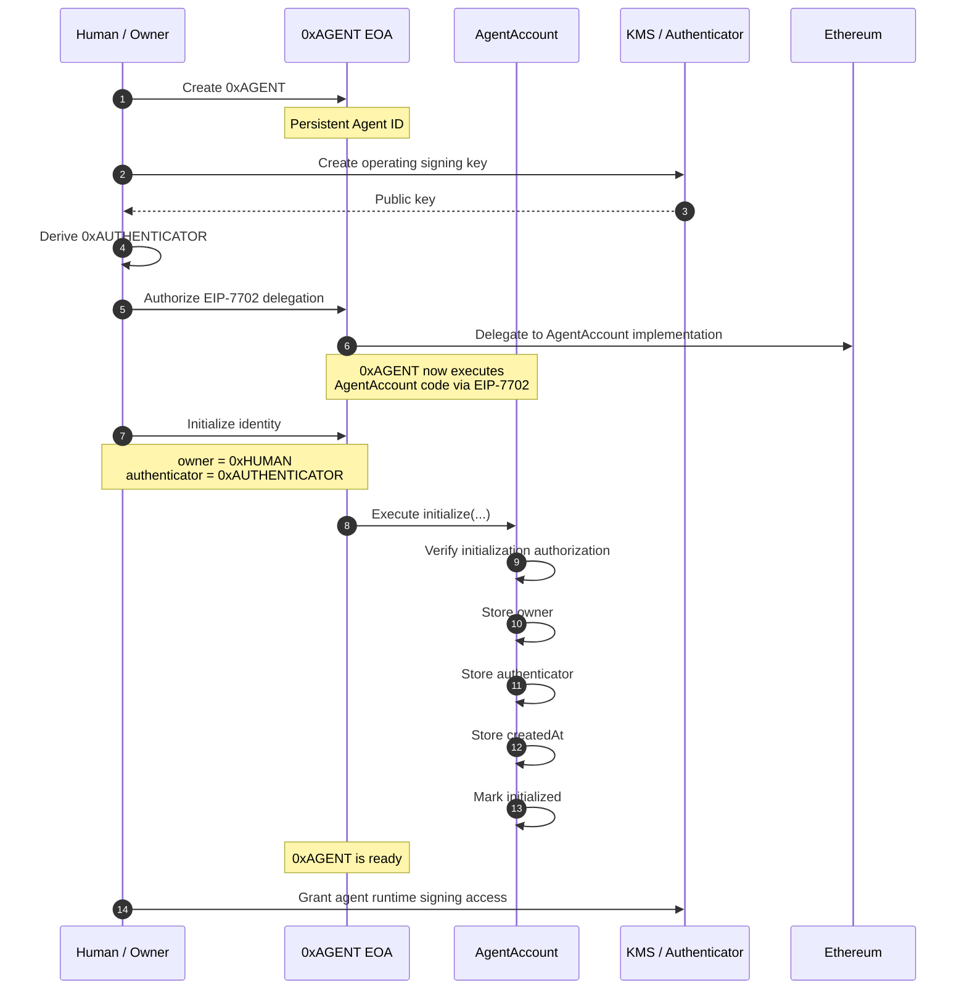
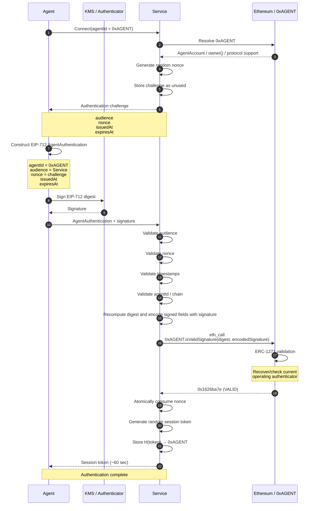
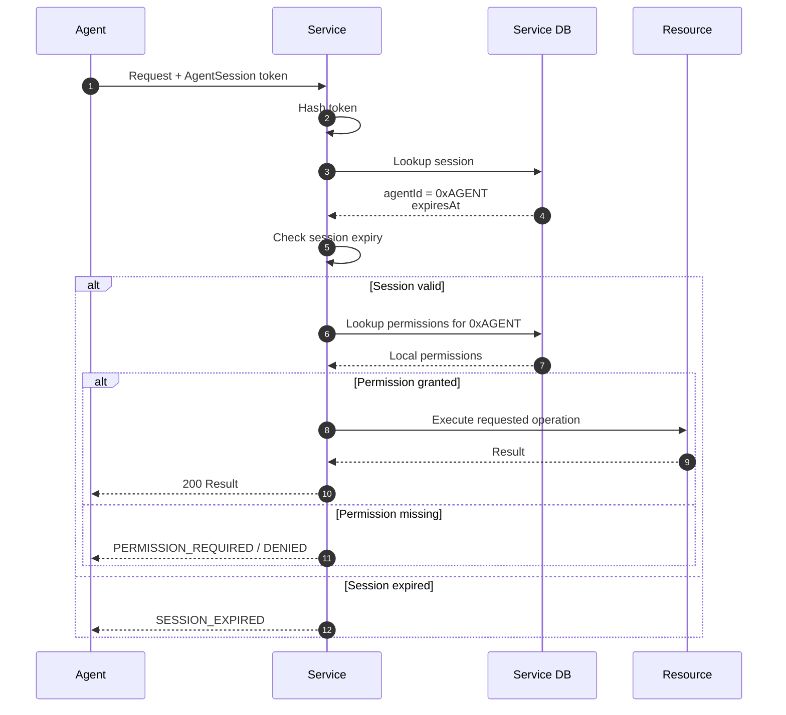

# Agentic World protocol

Agentic World gives an autonomous agent a persistent Ethereum identity that independent services can authenticate. The agent does not need its human owner's OAuth token, API key, or service session.

This document describes the protocol intended for the ETHGlobal Tokyo 2026 prototype. The handoff's unresolved choices remain open where marked below.

## Responsibility boundary

Ethereum and the agent account provide a shared identity and a way to check its current authentication authority. Each service decides whether the agent may use its resources. Services maintain their own registration, access rules, challenge records, payments, and sessions. They can verify the agent through Ethereum without an Agentic World authentication server.

The account also governs actions initiated *from the agent account*, such as token payments. That execution policy is separate from a service's resource access policy.

## Identity and keys

```text
0xAGENT root EOA key  ── EIP-7702 delegation ──> AgentAccount at 0xAGENT
                                                  ├── owner: human/org controller
                                                  └── authenticator: operating signer
```

- `0xAGENT` is the stable public identity. Rotating the operating signer does not change it.
- The root EOA key retains ultimate authority to change or clear EIP-7702 delegation. The agent runtime must not hold it.
- The owner controls lifecycle operations inside the delegated account, including rotating or revoking the authenticator.
- The authenticator signs routine authentication proofs. Its private key may be held by AWS KMS. It cannot manage identity lifecycle or loosen execution policy.

EIP-7702 delegation does not initialize account storage. Bootstrap must be one-time and authorized by the root EOA key; an unauthenticated, first-caller-wins initializer is unsafe. The exact bootstrap transaction and signatures remain an open design decision. [EIP-7702 security considerations](https://eips.ethereum.org/EIPS/eip-7702#front-running-initialization)

### Agent creation and bootstrap



The diagram separates the agent address from its delegated implementation for readability. Delegated code runs in `0xAGENT`'s account context, so the initialized storage belongs to `0xAGENT`. `initialize(...)` must check authorization from the root EOA key before setting owner and authenticator; the exact signed bootstrap format remains open.

## Reference authentication handshake

```text
Service generates and stores a random, single-use challenge
  → Agent builds an AgentAuthentication message for that service
  → Agent computes its EIP-712 digest
  → Operating key signs the digest, optionally through KMS
  → Agent sends the message and signature to the service
  → Service validates the message against its challenge
  → Service computes the digest itself
  → Service encodes the signed fields with the operating-key signature
  → Service calls 0xAGENT.isValidSignature(digest, encodedSignature) via eth_call
  → Account returns 0x1626ba7e only for a valid current authenticator
  → Service atomically consumes the challenge and creates a short session
  → Service applies its own access rules to resource requests
```

### First connection, authentication, and session



The service constructs the EIP-712 domain with its expected `chainId` and `verifyingContract = agentId`. The `encodedSignature` call argument is the service's proposed packaging of the signed fields and operating-key signature described below.

The agent sends this proof to the service:

```text
{
    agentId     // 0xAGENT
    audience    // the intended service
    nonce       // the service's challenge
    issuedAt
    expiresAt
    signature   // operating-key ECDSA signature, sent alongside the signed data
}
```

The EIP-712 digest covers the `AgentAuthentication` fields below. The signature is the result of signing that digest; it is not itself a field inside the signed struct.

```text
EIP712Domain {
    name
    version
    chainId
    verifyingContract = agentId
}

AgentAuthentication {
    agentId
    audience
    nonce
    issuedAt
    expiresAt
}
```

The service builds the domain from its expected chain and the challenge-bound `agentId`, then recomputes the digest. It does not trust domain fields or a digest supplied by the agent. The exact type string, domain name/version, audience encoding, timestamp units, and clock skew allowance must be frozen before implementation. [EIP-712](https://eips.ethereum.org/EIPS/eip-712)

### What each verifier checks

The service generates an unpredictable challenge, preferably 256 bits, and stores it with the expected agent, audience, expiry, and consumption state. If the agent is new to the service, the service binds the claimed `agentId` to that challenge when it issues it.

Before `eth_call`, the service checks:

1. `agentId` equals the agent bound to its challenge; this is the `0xAGENT` it will call.
2. The EIP-712 domain's `verifyingContract` equals `agentId`.
3. The EIP-712 domain's `chainId` equals the service's expected chain.
4. `audience` equals this service's configured audience.
5. `nonce` exists in the service's challenge store, is unused, and is still within the challenge's lifetime.
6. `issuedAt` is within the service's allowed time window, and `expiresAt` has not passed.

The service recomputes the digest from those verified fields and the expected domain. A valid ERC-1271 result is followed by atomic challenge consumption and session issuance.

The service must also establish that `0xAGENT` currently exposes the expected Agentic World behavior. The precise version/discovery mechanism is still open. A claimed version or ERC-165 response alone is not a security guarantee about arbitrary account code.

The account's ERC-1271 method checks the digest and signature against its current authentication policy. On success it returns the standard magic value `0x1626ba7e`. The method is read-only; it cannot consume the service's challenge. The service therefore consumes the challenge atomically after successful verification, so two concurrent submissions cannot create two sessions from one nonce. [ERC-1271](https://eips.ethereum.org/EIPS/eip-1271)

The return value means the account accepts **this signature for this digest in the current onchain state**. It does not mean the service's nonce is fresh, the audience is correct, or the agent has permission to use a resource. Those checks belong to the service.

### Restrict what the operating key can sign for

This restriction is especially important because v3 also gives the account an execution policy. A generic `isValidSignature(hash, rawOperatingSignature)` implementation would accept any digest signed by the operating key. Another application that accepts ERC-1271 signatures could then treat that key as a broader wallet signer, bypassing the intended account execution boundary.

For the prototype, the service should encode the signed `AgentAuthentication` fields together with the received operating-key ECDSA signature as the ERC-1271 `signature` argument. The account recomputes the allowed typed digest using its own address as `verifyingContract` and the expected chain ID, requires it to equal the supplied `hash`, checks that the authenticator is active, and only then validates the ECDSA signature. The service still verifies its own audience, challenge, and time rules. This encoding is a proposed resolution of the open signature-format decision; it needs a concrete test against other ERC-1271 consumers before the ABI is frozen.

Owner approvals for account actions use a **separate** typed message and replay nonce. The operating authenticator's authentication proof must never double as an owner approval.

### KMS signing

When AWS KMS signs an already computed EIP-712 digest, its request must use `MessageType: DIGEST` to avoid hashing the digest again. KMS returns an ECDSA signature in DER format; the agent signer adapts it to the signature format expected by the account and handles low-s normalization and recovery parity correctly. KMS protects key custody, but a compromised runtime that may call `kms:Sign` can still request signatures until that access is removed. [AWS KMS Sign API](https://docs.aws.amazon.com/kms/latest/APIReference/API_Sign.html)

### Session and revocation semantics

A successful handshake may produce a short-lived, opaque service-local session. A 60-second lifetime is a demo default, not a protocol rule. The token is a cached authentication result, not the agent's identity or a grant of resource access; the service checks its own permissions on use.

### Requests after session creation



Rotating or revoking the authenticator blocks *new* authentication once the service observes the changed chain state. An existing session may remain usable until its expiry unless the service checks an authentication epoch or another revocation signal on each request. Immediate invalidation is an open product decision; the prototype must describe whichever behavior it implements. The root EOA can also change delegated code, so services must not treat a prior verification as a permanent guarantee about current account behavior.

## Authorization and owner association

After authentication, the service can look up its own registration, permissions, subscription, or paid access grant for `0xAGENT`. Authentication alone grants no resource access.

The account may expose `owner() -> 0xHUMAN` so a service can identify a possible relationship with an existing human account. The service must decide how it establishes the human's consent before linking privileged access; the getter alone must not cause the agent to inherit the human's permissions.

## Per-request authentication

A service may require a fresh signature for each request or for selected sensitive actions. That message must additionally bind the HTTP method, canonical path, body hash, and a fresh replay value. The session establishment message above does not need request fields. Per-request signing is optional for the hackathon prototype.

## Account execution policy

The delegated account can enforce which account actions the operating signer may initiate alone and which require an owner signature. The recommended hackathon demonstration is a narrowly defined small payment allowed autonomously and a larger payment requiring an approval bound to the agent, chain, target, value, call data, nonce, and deadline.

The owner alone may change the execution policy and operating authenticator. Approval nonces belong to the account execution protocol; they are separate from service authentication challenges. The exact payment limit and cumulative budget rules are still open. No service-specific permissions or subscriptions belong in the core account.

## Demo acceptance cases

- The same `0xAGENT` authenticates independently to two services using one operating key, without sharing their challenge or session databases.
- A proof issued for Service A fails at Service B; an expired or already consumed challenge fails at Service A.
- The service denies a resource when its local permission is absent, even after successful authentication.
- After the owner rotates the authenticator, the old key cannot create a new session and the new key can, while `0xAGENT` remains unchanged.
- The operating key cannot approve an owner-only action or expand its own execution limits.

## Decisions still open

The handoff leaves protocol discovery/versioning, secure bootstrap mechanics, the final EIP-712 field types and encoding, optional authenticator expiry and epoch, session lifetime/revocation behavior, and the account execution ABI to be finalized. The proof fields and verification checks above are the expected authentication path; they do not settle those remaining implementation details by implication.
